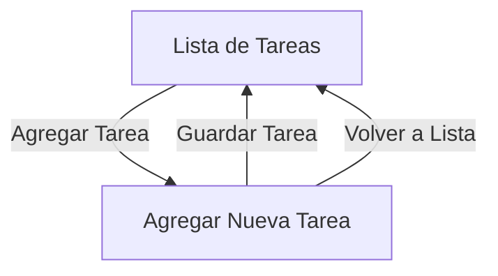

### Descripción del Diagrama

1. **Lista de Tareas**: Esta es la pantalla principal donde se ven todas las tareas. Hay un botón para "Agregar Tarea".
2. **Agregar Nueva Tarea**: Al hacer clic en "Agregar Tarea", se navega a esta pantalla donde se puede ingresar una nueva tarea. 
   - Hay un botón para "Guardar Tarea" que, al hacer clic, guarda la tarea y regresa a la lista.
   - También hay un botón para "Volver a Lista" que regresa directamente a la pantalla de la lista de tareas sin guardar.

