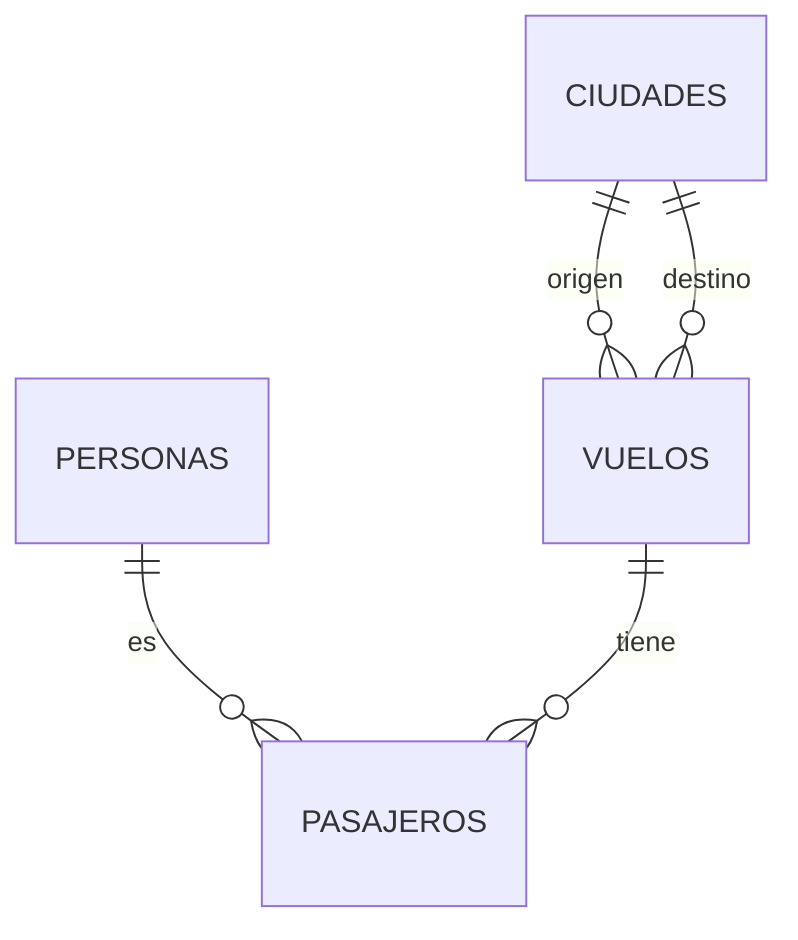

# Diagrama ER

# Diccionario de Datos

| Entidad   | Atributo      | Tipo de Dato | Descripción                              |
|-----------|---------------|--------------|------------------------------------------|
| PERSONAS  | id            | int          | Identificador único de la persona.       |
|           | nombre        | varchar(20)  | Nombre de la persona.                    |
|           | apellido      | varchar(20)  | Apellido de la persona.                  |
| CIUDADES  | id            | int          | Identificador único de la ciudad.        |
|           | codigo        | varchar(5)   | Código de la ciudad (ej. IATA).          |
|           | ciudad        | varchar(10)  | Nombre de la ciudad.                     |
| VUELOS    | id            | int          | Identificador único del vuelo.           |
|           | origen_id     | int          | ID de la ciudad de origen.               |
|           | destino_id    | int          | ID de la ciudad de destino.              |
|           | duracion      | int          | Duración del vuelo en minutos.           |
| PASAJEROS | persona_id    | int          | ID de la persona que viaja.              |
|           | vuelo_id      | int          | ID del vuelo en el que viaja.            |

## Descripción de Relaciones

- **PERSONAS** a **PASAJEROS**: Una persona puede estar asociada a múltiples registros en la tabla de pasajeros (relación uno a muchos).
- **VUELOS** a **PASAJEROS**: Un vuelo puede tener múltiples pasajeros (relación uno a muchos).
- **CIUDADES** a **VUELOS**: Cada vuelo tiene una ciudad de origen y una ciudad de destino (relación uno a muchos).
